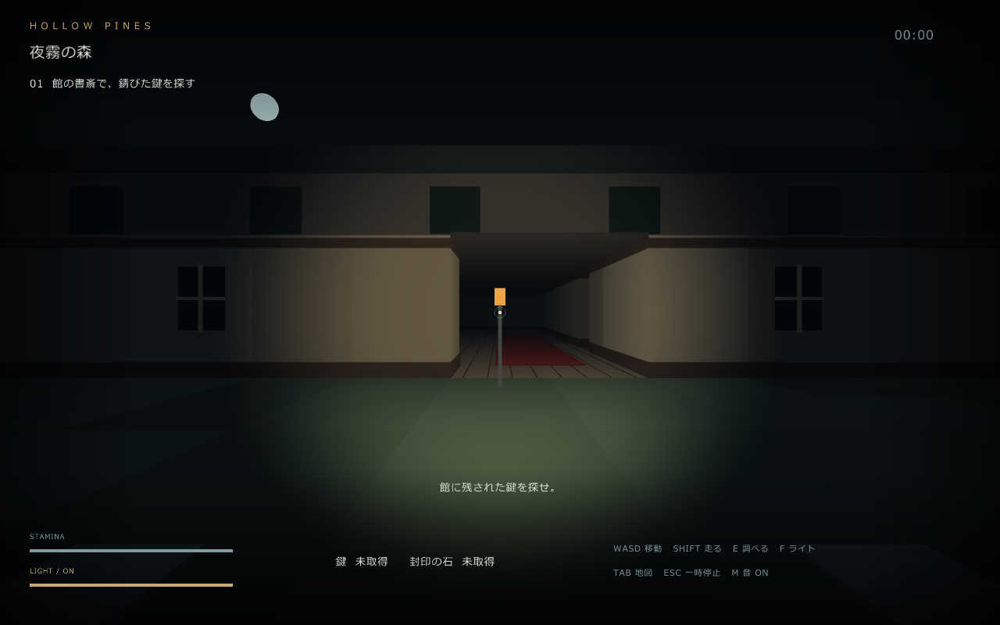
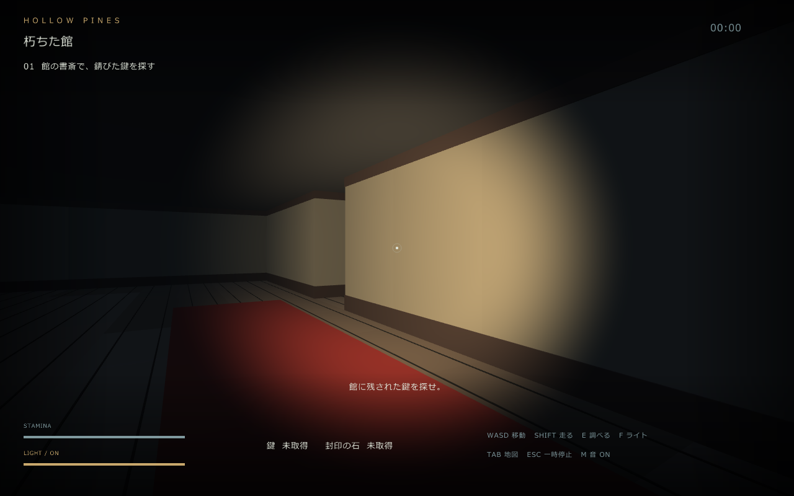

# HOLLOW PINES — 夜霧の館

森で目を覚ました。帰り道は、封じられていた。
館に残された鍵、洞窟の奥に眠る石。そして、闇の中から迫る影。

**HOLLOW PINES — 夜霧の館** は、夜霧の森を探索し、封印された出口からの脱出を目指す一人称視点の3Dホラーゲームです。
懐中電灯で足元を照らし、朽ちた館と洞窟を巡りながら、追いかけてくる幽霊から逃れてください。
光で足止めするか、走って距離を取るか。電池とスタミナを見ながら進みましょう。

## スクリーンショット

夜霧の森にたたずむ館。

鍵を探して、暗い館の中へ。

## はじめかた

Windows x64 向けです。キーボードとマウス、OpenGL 3.3 に対応したGPUが必要です。日本語の表示には、Windowsのメイリオまたは游ゴシックを使用します。

1. 配布ファイル `Horror3D.zip` をフォルダへすべて展開します。
2. 展開先の `HorrorGame.exe` を起動します。
3. タイトル画面で **Enter** を押すとゲームが始まります。

配布版には .NET ランタイムを同梱しています。実行ファイルだけを取り出さず、DLLや `Shaders` フォルダなども一緒に置いてください。

## 操作方法

| キー | 操作 |
| --- | --- |
| W / A / S / D | 前進 / 左移動 / 後退 / 右移動 |
| マウス | 視点を動かす |
| 左Shift（押しながら移動） | ダッシュ。スタミナを消費します |
| E | 近くのアイテムを拾う・鉄格子を開ける・出口を調べる |
| F | 懐中電灯のオン・オフ |
| Tab | 地図を表示・非表示 |
| Space | 魔法のショットガンを発射（入手後） |
| Esc | プレイ中の一時停止・再開 |
| Q | 一時停止中にゲームを終了 |
| Alt + Enter | 全画面表示・ウィンドウ表示の切り替え |
| M | ミュートのオン・オフ |
| R / Enter | ゲームオーバー・クリア後に最初から再挑戦 |

ゲームオーバー・クリア画面では **Esc** でタイトルへ戻ります。タイトル画面で **Esc** を押すと終了します。
別のウィンドウへ切り替えると自動で一時停止するので、戻ったら **Esc** で再開してください。

## 脱出までの流れ

1. **館で鍵を探す。** 森の東側にある館へ向かい、南側の玄関から入りましょう。書斎にある鍵へ近づき、**E** で拾います。
2. **洞窟を開く。** 館を出て西側の洞窟へ向かい、鉄格子の前で **E** を押して鍵を使います。
3. **封印の石を手に入れる。** 洞窟の奥を探索し、青緑色に浮かぶ石を **E** で拾います。
4. **森の南端へ戻る。** 祭壇の前で **E** を押し、出口の封印を解けば脱出成功です。

次の目標は画面左上に表示されます。調べられるものに近づくと、画面に **[E]** の案内が出ます。

## 生き延びるためのヒント

- **迷ったら地図を確認。** 上が北、白い点が現在地、金色の点が次の目的地です。地図を開いている間も時間は進みます。休むときは **Esc** で一時停止してください。
- **鍵を拾うと幽霊が動き出します。** 捕まるとゲームオーバーです。接近を知らせる画面のメッセージや鼓動にも注意しましょう。
- **幽霊に光を向けると、動きを遅くできます。** 壁越しには効きません。光を当てながら後退し、ダッシュで距離を取りましょう。
- **電池とスタミナは回復します。** 左下の `STAMINA` がスタミナ、`LIGHT` が電池残量です。スタミナは走っていない間に、電池は消灯中に回復します。電池が切れると自動で消灯するので、回復を待って **F** で点灯してください。
- **石を拾ったあとは帰り道にも注意。** 幽霊の追跡速度が上がります。南端で青緑色に明滅する祭壇が出口の目印です。

## 隠し要素

隠し武器と結末のヒントを見る（ネタバレ）

封印の石を手に入れると、マップの北東の端に魔法のショットガンが出現します。近づいて **E** で拾い、**Space** で照準の方向へ発射できます。弾数は無制限ですが、次の発射まで少し間隔が必要です。弾は壁や木に遮られます。

幽霊に命中すると一撃で倒せます。倒した幽霊は、そのプレイ中には復活しません。武器を手に入れなくても、石を祭壇へ持ち帰れば脱出できます。

幽霊を倒したら、館へ戻ってみてください。助かった家族が待っています。家族を撃つと、その後の結末が変わります。

- 家族を撃たずに脱出すると **GOOD END** です。幽霊を倒さずに脱出した場合も同じです。
- 家族を撃ち、生存者がいる状態で脱出すると **BAD END** になります。
- 家族を全員撃つと、出口が閉ざされて脱出できなくなります。**R** で最初からやり直せます。

## プレイについて

現在は、ひとつのマップを探索するプロトタイプです。セーブ機能はなく、終了後や再挑戦時は最初からのスタートになります。ジャンプ操作はありません。
